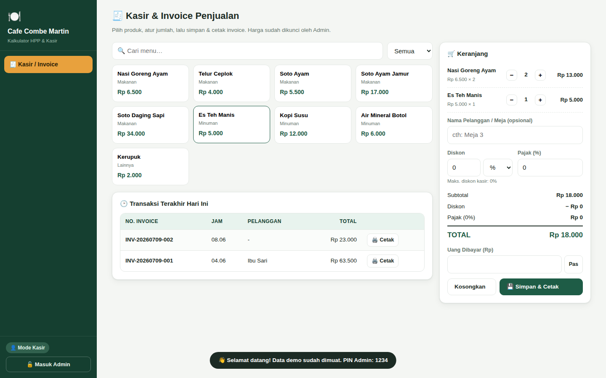
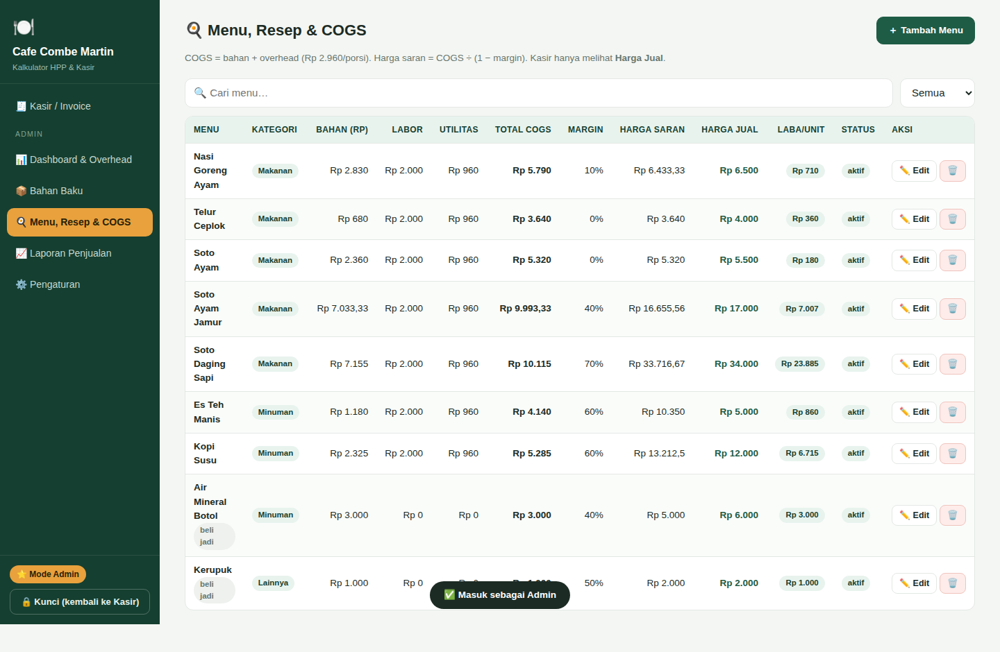
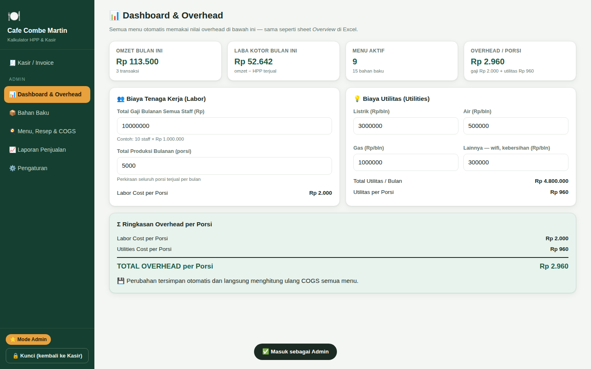
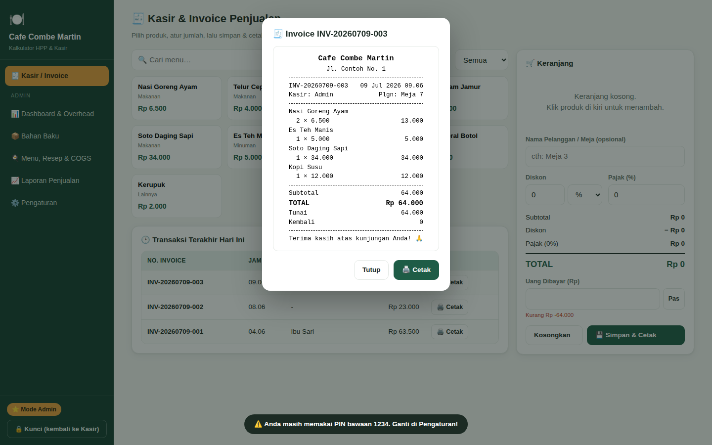
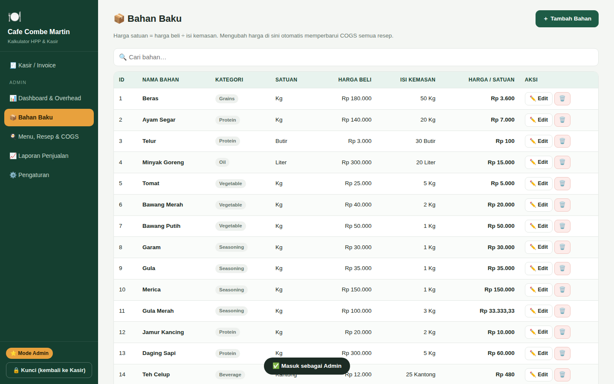
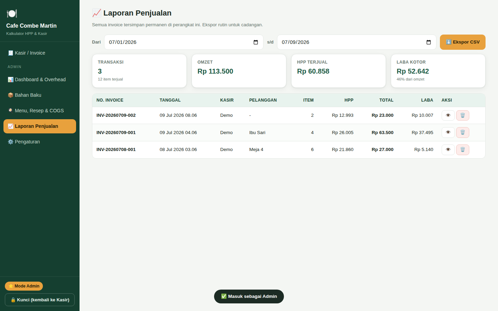

> £ **Baru:** [**Catatan Keuangan**](keuangan/) — aplikasi pencatatan keuangan bulanan **pribadi**
> dalam **poundsterling (£)**: batas pengeluaran rinci, scan struk belanja, dan **review bulanan**
> berikut grafik yang bisa disimpan sebagai PDF.
> Panduan: [keuangan/PANDUAN_KEUANGAN.md](keuangan/PANDUAN_KEUANGAN.md).

# 🍽️ Warung COGS — Kalkulator HPP & Kasir Restoran

Aplikasi lengkap untuk usaha restoran/cafe: menghitung **COGS/HPP per menu** (mengikuti persis rumus
Excel `COGS_Final_Combe_Martin.xlsx`), menetapkan harga jual dengan margin, plus **kasir & invoice
penjualan** untuk makanan, minuman, dan produk lainnya.

**Satu file. Tanpa instalasi. Tanpa internet. Gratis.**

## ⬇️ Cara Download & Pakai

1. Download file **`index.html`** (atau **Code → Download ZIP** lalu ekstrak).
2. Klik dua kali `index.html` — terbuka di browser laptop/HP mana pun.
3. Data demo otomatis dimuat. **PIN Admin bawaan: `1234`** (segera ganti!).
4. Salin file yang sama ke perangkat kasir lain bila dipakai beberapa orang.

📖 Panduan lengkap: **[PETUNJUK_PENGGUNAAN.md](PETUNJUK_PENGGUNAAN.md)**

## ✨ Fitur

- **📊 Dashboard & Overhead** — gaji staff, listrik, air, gas → otomatis jadi biaya per porsi (rumus sheet *Overview*).
- **📦 Bahan Baku** — tambah/edit/hapus bahan; harga satuan = harga beli ÷ isi kemasan; ubah harga bahan sekali, semua COGS resep ter-update.
- **🍳 Menu, Resep & COGS** — susun resep per porsi, COGS = bahan + overhead, harga saran = COGS ÷ (1 − margin), laba per unit langsung terlihat. Mendukung produk *beli jadi* (air mineral, kerupuk, dsb.).
- **🧾 Kasir & Invoice** — klik produk → keranjang → diskon/pajak → cetak struk dengan nomor invoice otomatis; cetak ulang transaksi hari ini.
- **📈 Laporan Penjualan** — omzet, HPP terjual, laba kotor per rentang tanggal; ekspor CSV ke Excel.
- **🔐 Aman dari kasir** — mode Kasir tidak bisa mengubah harga/resep/laporan; mode Admin dilindungi PIN (ter-hash SHA-256) dan terkunci otomatis setelah 5 menit; batas diskon kasir bisa diatur.
- **☁️ Sinkronisasi antar-perangkat (real-time)** — hubungkan HP kasir & perangkat pemilik lewat Firebase gratis: pantau transaksi dari mana saja, ubah harga dari rumah. Panduan: [PANDUAN_SINKRONISASI.md](PANDUAN_SINKRONISASI.md).
- **📱 Ter-install seperti aplikasi (PWA)** — tambah ke layar utama HP: layar penuh tanpa browser, tetap jalan offline.
- **💾 Data besar & backup** — penyimpanan IndexedDB (ratusan ribu transaksi); ekspor/impor JSON untuk backup dan pemindahan data.

## 🎬 Contoh Demonstrasi

Aplikasi terisi otomatis dengan data demo dari Excel Anda (13 bahan + menu Nasi Goreng Ayam, Soto, dll. + minuman + 3 contoh invoice), jadi langsung bisa dicoba:

1. Buka aplikasi → mode Kasir → klik *Nasi Goreng Ayam* 2× dan *Es Teh Manis* 1× → total **Rp 18.000** → tombol **Pas** → **Simpan & Cetak** → struk tampil.
2. Klik **Masuk Admin** → PIN `1234` → buka **Menu, Resep & COGS**: Nasi Goreng Ayam terlihat COGS **Rp 5.790** (bahan 2.830 + gaji 2.000 + utilitas 960), margin 10% → harga saran Rp 6.433.
3. Buka **Bahan Baku** → Edit *Ayam Segar* → naikkan harga → kembali ke menu: COGS semua resep berayam ikut naik otomatis.
4. Buka **Laporan Penjualan** → terlihat omzet, HPP, dan laba kotor dari transaksi demo.

| Kasir & Invoice | Menu, Resep & COGS |
|---|---|
|  |  |

| Dashboard Overhead | Struk Invoice |
|---|---|
|  |  |

| Bahan Baku | Laporan Penjualan |
|---|---|
|  |  |

## 🧮 Rumus (identik dengan Excel)

```
Harga satuan bahan  = harga beli ÷ isi kemasan
Biaya bahan/porsi   = Σ (qty per porsi × harga satuan)
Labor/porsi         = total gaji bulanan ÷ produksi bulanan (porsi)
Utilitas/porsi      = (listrik + air + gas + lainnya) ÷ produksi bulanan
TOTAL COGS          = bahan + labor + utilitas
Harga saran         = COGS ÷ (1 − margin%)
Laba/unit           = harga jual − COGS
```

Seluruh perhitungan telah diverifikasi otomatis cocok dengan nilai di Excel (mis. Soto Daging Sapi:
COGS Rp 10.115, margin 70% → harga saran Rp 33.716,67).

## 🛠️ Teknis

HTML + CSS + JavaScript murni dalam satu file, penyimpanan IndexedDB (fallback localStorage),
PIN di-hash SHA-256 (WebCrypto + fallback murni JS untuk `file://`), responsif untuk HP/tablet/desktop,
stylesheet cetak khusus struk thermal.
