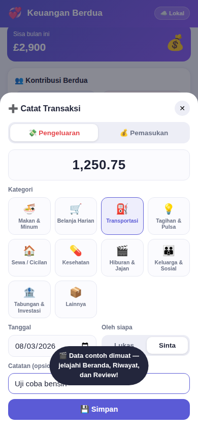
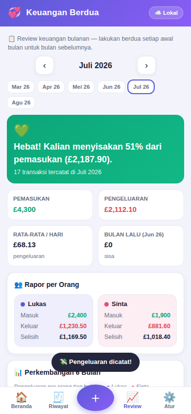

# 💞 Keuangan Berdua — Panduan Lengkap

Aplikasi catatan keuangan bulanan untuk **dua orang dengan dua HP berbeda**. Setiap pemasukan dan
pengeluaran yang dicatat salah satu orang **langsung muncul di HP satunya** (real-time), lengkap
dengan anggaran per kategori dan **review keuangan setiap bulan**.

**Satu file. Tanpa server sendiri. Gratis.**

---

## 1. Cara Memasang di HP (lakukan di KEDUA HP)

### Cara termudah (lewat internet)
1. Buka alamat aplikasi di browser HP:

   **https://lukas2407.github.io/Combe-Martin-Repository/keuangan/**

   (Alamat ini aktif otomatis lewat GitHub Pages — workflow deploy ada di `.github/workflows/pages.yml`.)
2. **Android (Chrome):** menu ⋮ → *Tambahkan ke layar utama* / *Instal aplikasi*.
3. **iPhone (Safari):** tombol Bagikan ⬆️ → *Tambah ke Layar Utama*.
4. Aplikasi muncul di layar utama dengan ikon 💜£, terbuka layar penuh, dan tetap jalan offline.
5. Ulangi langkah yang sama di HP kedua — atau lebih mudah: dari aplikasi, buka
   **Atur → 📲 Cara Pakai di 2 HP → Bagikan link**.

### Tanpa hosting (offline)
Kirim file `index.html` ke kedua HP (WhatsApp/email/kabel), lalu buka dengan browser.
Semua fitur jalan, hanya saja tidak bisa "di-install" sebagai aplikasi — dan sinkronisasi
tetap butuh internet.

## 2. Pengaturan Awal

Saat pertama dibuka, aplikasi menanyakan:

1. **Nama kalian berdua** — misal *Lukas* dan *Sinta*.
2. **HP ini dipakai oleh siapa** — di HP Lukas pilih *Lukas*, di HP Sinta pilih *Sinta*.
   Dengan begitu setiap catatan otomatis diberi label siapa yang mencatat.

Semua ini bisa diubah kapan saja lewat **Atur → Profil Berdua**.

**Mata uang bawaannya poundsterling (£)** lengkap dengan pence (misal £12.50). Kalau kalian ingin
memakai Rupiah, ganti di **Atur → Profil Berdua → Mata uang** — pilihan ini berlaku untuk kedua HP
(ikut tersinkron). Nominal yang sudah tercatat tidak dikonversi otomatis, jadi tentukan mata uangnya
sejak awal.

## 3. Mencatat Keuangan Sehari-hari

- Tekan tombol **＋** besar di tengah bawah.
- Pilih **💸 Pengeluaran** atau **💰 Pemasukan**, isi nominal, pilih kategori
  (Makan, Belanja, Transportasi, Tagihan, dll.), tanggal, siapa yang mencatat, dan catatan singkat.
- Simpan → langsung terlihat di **Beranda** dan (jika sinkron aktif) di HP pasangan dalam hitungan detik.
- Salah catat? Buka transaksinya dari Beranda/Riwayat → ubah atau hapus.

### Anggaran (budget) per kategori
Di **Atur → Kategori & Anggaran**, tekan ✏️ pada kategori pengeluaran dan isi anggaran per bulan
(misal Belanja Harian Rp 2.000.000). Beranda akan menampilkan bilah kemajuan yang berubah kuning
saat mendekati batas dan merah saat terlampaui.

### Melihat detail
Tab **🧾 Riwayat** menampilkan seluruh transaksi per bulan, bisa disaring per orang, per jenis
(masuk/keluar), dan dicari berdasarkan catatan/kategori. Panah ‹ › di atas untuk pindah bulan.

## 4. Review Setiap Bulan 📈

Inilah ritual bulanannya — lakukan **berdua** di awal bulan untuk bulan yang baru selesai:

1. Di awal bulan, Beranda otomatis menampilkan pengingat **"Waktunya review bulanan!"**
   selama bulan lalu belum ditandai selesai. Tekan **Mulai**.
2. Halaman Review menampilkan:
   - **Vonis kesehatan keuangan** — berapa % pemasukan yang berhasil disisakan (atau peringatan defisit);
   - **Perbandingan dengan bulan sebelumnya** — pemasukan/pengeluaran naik atau turun berapa persen;
   - **Rapor per orang** — pemasukan, pengeluaran, dan selisih masing-masing;
   - **Anggaran vs realisasi** per kategori dengan tanda ✅/❌;
   - **5 pengeluaran terbesar** bulan itu;
   - Rata-rata pengeluaran per hari.
3. Diskusikan, lalu tulis kesepakatan kalian di **Catatan & Kesepakatan Review**
   (misal: *"Bulan depan jajan kopi maksimal 300 ribu"*). Catatan ini ikut tersinkron ke HP pasangan.
4. Tekan **✅ Tandai Review Selesai** — bulan itu mendapat centang hijau di riwayat review,
   tercatat siapa yang menandai dan kapan.

## 5. Sinkronisasi 2 HP (sekali pasang, ±5 menit)

Data tersimpan di **Firebase** (layanan database Google) pada **akun kalian sendiri** — paket
gratisnya jauh lebih dari cukup untuk catatan rumah tangga.

### Langkah A — Buat proyek Firebase (cukup salah satu orang)
1. Buka **https://console.firebase.google.com** → login akun Google.
2. **Create a project** → beri nama, mis. `keuangan-kita` → matikan Google Analytics → **Create**.

### Langkah B — Nyalakan database Firestore
1. Menu kiri: **Build → Firestore Database** → **Create database**.
2. Lokasi server: **asia-southeast2 (Jakarta)** → Next → **Start in production mode** → **Create**.
3. Buka tab **Rules**, ganti seluruh isinya dengan ini, lalu **Publish**:

```
rules_version = '2';
service cloud.firestore {
  match /databases/{database}/documents {
    match /couples/{coupleId}/{document=**} {
      allow read, write: if true;
    }
  }
}
```

> 🔐 **Keamanannya dari mana?** Data tersimpan di bawah **ID Keluarga** — kode acak panjang yang
> hanya diketahui HP kalian berdua (seperti nomor rekening rahasia). Tanpa ID itu data tidak bisa
> ditemukan. Karena itu **jangan bagikan ID Keluarga** ke siapa pun.

### Langkah C — Ambil 2 kode proyek
1. ⚙️ **Project settings** → gulir ke **Your apps** → klik ikon **`</>`** (Web) → beri nama bebas → **Register app**.
2. Dari kode `firebaseConfig` yang tampil, catat dua nilai:
   - `apiKey` — contoh: `AIzaSyB1234…`
   - `projectId` — contoh: `keuangan-kita`

### Langkah D — Sambungkan kedua HP
Di **HP pertama**:
1. **Atur → ☁️ Sinkronisasi 2 HP** → centang *Aktifkan sinkronisasi cloud*.
2. Isi **API Key** dan **Project ID** dari Langkah C.
3. Tekan **🎲** untuk membuat **ID Keluarga** acak → tekan **📋** untuk menyalin → kirim ke pasangan
   (misal lewat WhatsApp, lalu hapus pesannya).
4. **💾 Simpan & Sambungkan** → lencana di pojok kanan atas berubah **"☁️ Tersinkron"** hijau.
   Data yang sudah ada di HP ini otomatis terunggah.

Di **HP kedua**: ulangi langkah yang sama dengan **API Key, Project ID, dan ID Keluarga yang SAMA
PERSIS** → seluruh catatan langsung tergabung.

### Uji coba
Catat satu pengeluaran di HP pertama → dalam ±2 detik muncul di HP kedua disertai notifikasi
*"🔄 Ada catatan baru dari pasanganmu"*. Selesai! 🎉

## 6. Hal yang Perlu Diketahui

| Hal | Penjelasan |
|---|---|
| Butuh internet? | Hanya untuk sinkron. Tanpa internet aplikasi tetap jalan (tersimpan lokal) dan otomatis menyusul terkirim saat online. |
| Apa saja yang tersinkron | Transaksi, kategori & anggaran, nama kalian, dan catatan review. Pilihan "HP ini dipakai oleh" tetap per-HP. |
| Menghapus transaksi | Terhapus di kedua HP. |
| "Hapus SEMUA data" | Juga membersihkan data di cloud (HP pasangan ikut kosong) — hati-hati. |
| Cadangan | **Atur → Data & Cadangan → Ekspor JSON** menghasilkan file cadangan yang bisa diimpor kembali kapan saja. |
| Biaya | Paket gratis Firebase: 50.000 baca & 20.000 tulis per hari — jauh di atas kebutuhan rumah tangga. |
| Coba-coba dulu | Saat data masih kosong ada tombol **🎬 Isi data contoh** untuk melihat semua fitur (termasuk Review) dengan data pura-pura. |

## 7. Tampilan Aplikasi

| Beranda | Riwayat |
|---|---|
|  |  |

| Catat Transaksi | Review Bulanan |
|---|---|
|  |  |

## 8. Pemecahan Masalah

- **Lencana "☁️ Gagal"** → periksa API Key/Project ID (salah ketik penyebab #1), pastikan Firestore
  sudah dibuat (Langkah B) dan rules sudah di-Publish.
- **Catatan tidak muncul di HP pasangan** → pastikan **ID Keluarga sama persis** di kedua HP
  (huruf besar/kecil berpengaruh).
- **ID Keluarga bocor?** → di salah satu HP buat ID baru dengan 🎲 → Simpan & Sambungkan
  (data terunggah ulang ke "brankas" baru) → perbarui ID di HP pasangan.
- **Ganti HP** → install aplikasi di HP baru → isi konfigurasi sinkron yang sama → semua data
  turun sendiri dari cloud. Tanpa sinkron: gunakan Ekspor/Impor JSON.
