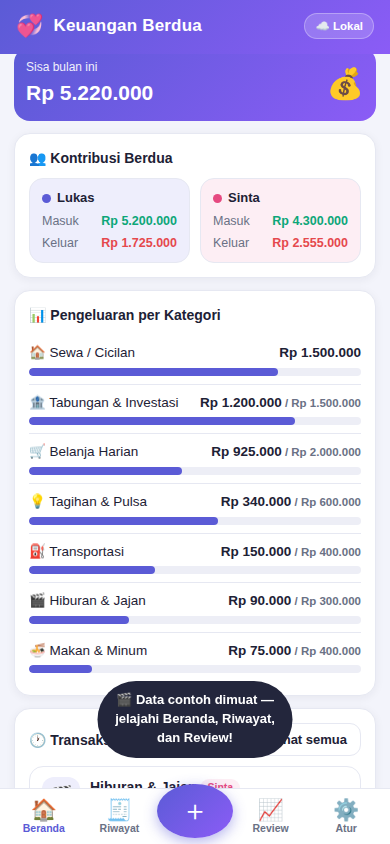
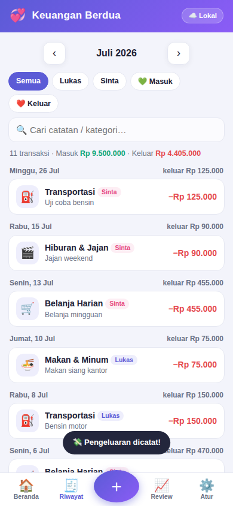
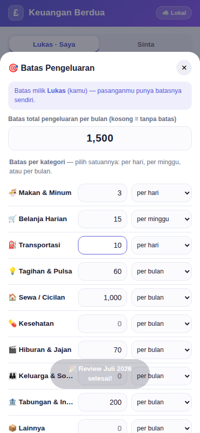

# 💞 Keuangan Berdua — Panduan Lengkap

Aplikasi catatan keuangan bulanan untuk **dua orang dengan dua HP berbeda**. Setiap layar
menampilkan **keuangan satu orang saja**, jadi angkanya tidak tercampur. Data kalian tetap
**tersinkron real-time** antar HP, dan lewat tombol pengalih di bagian atas kalian bisa melihat
perkembangan pasangan kapan saja. Dilengkapi **batas pengeluaran yang rinci** (total bulanan dan
per kategori, bisa dipatok harian/mingguan/bulanan, lengkap dengan peringatan otomatis) serta
**review keuangan setiap bulan**.

**Satu file. Tanpa server sendiri. Gratis.**

---

## 1. Cara Memasang di HP (lakukan di KEDUA HP)

### Cara termudah (lewat internet)
1. Buka alamat aplikasi di browser HP:

   **https://lukas2407.github.io/Combe-Martin-Repository/keuangan/**

   (Alamat ini aktif otomatis lewat GitHub Pages — workflow deploy ada di `.github/workflows/pages.yml`.)
2. **Android (Chrome):** menu ⋮ → *Tambahkan ke layar utama* / *Instal aplikasi*.
3. **iPhone (Safari):** tombol Bagikan ⬆️ → *Tambah ke Layar Utama*.
4. Aplikasi muncul di layar utama dengan ikon **£** ungu, terbuka layar penuh, dan tetap jalan offline.
5. Ulangi langkah yang sama di HP kedua — atau lebih mudah: dari aplikasi, buka
   **Atur → 📲 Cara Pakai di 2 HP → Bagikan link**.

### Tanpa hosting (offline)
Kirim file `index.html` ke kedua HP (WhatsApp/email/kabel), lalu buka dengan browser.
Semua fitur jalan, hanya saja tidak bisa "di-install" sebagai aplikasi — dan sinkronisasi
tetap butuh internet.

## 2. Pengaturan Awal

Saat pertama dibuka, aplikasi menanyakan:

1. **Nama kalian berdua** — misal *Lukas* dan *Sinta*.
2. **HP ini dipakai oleh siapa** — di HP Lukas pilih *Lukas*, di HP Sinta pilih *Sinta*.
   Dengan begitu setiap catatan otomatis diberi label siapa yang mencatat.

Semua ini bisa diubah kapan saja lewat **Atur → Profil Berdua**.

### Kunci pribadi 🔒
Buka **Atur → 🔒 Kunci Pribadi → Pasang PIN**. Setelah dipasang:

- Aplikasi meminta PIN setiap kali dibuka, dan **PIN yang dimasukkan menentukan catatan siapa yang terbuka**.
- Pasanganmu tidak bisa berpindah ke catatanmu tanpa PIN-mu, di HP mana pun — nama yang terkunci
  ditandai gembok 🔒 pada pengalih.
- Aplikasi mengunci sendiri setelah **5 menit menganggur** (bisa dimatikan), dan ada tombol
  **Kunci sekarang** bila HP mau dipinjamkan sebentar.
- PIN disimpan dalam bentuk **teracak SHA-256**, tidak pernah sebagai angka aslinya, jadi tidak bisa
  dibaca siapa pun termasuk dari file cadangan.

Masing-masing memasang PIN sendiri. Kalau salah satu lupa PIN-nya, pasangan bisa membuka dengan PIN
miliknya lalu menghapus/mengganti PIN yang lupa lewat Atur.

### Tampilan per orang
Di bagian atas Beranda, Riwayat, dan Review ada **tombol pengalih berisi nama kalian berdua**.
Yang tampil hanya keuangan orang yang sedang dipilih, tidak pernah keduanya sekaligus. Aplikasi
selalu terbuka pada pemilik HP itu (bertanda *· Saya*). Ketuk nama pasangan bila ingin melihat
catatan dan perkembangannya, lalu ketuk namamu lagi untuk kembali.

**Mata uang bawaannya poundsterling (£)** lengkap dengan pence (misal £12.50). Kalau kalian ingin
memakai Rupiah, ganti di **Atur → Profil Berdua → Mata uang** — pilihan ini berlaku untuk kedua HP
(ikut tersinkron). Nominal yang sudah tercatat tidak dikonversi otomatis, jadi tentukan mata uangnya
sejak awal.

## 3. Mencatat Keuangan Sehari-hari

- Tekan tombol **＋** besar di tengah bawah.
- Pilih **💸 Pengeluaran** atau **💰 Pemasukan**, isi nominal, pilih kategori
  (Makan, Belanja, Transportasi, Tagihan, dll.), tanggal, dan catatan singkat.
- Transaksi otomatis masuk ke catatan **orang yang sedang ditampilkan** — tertulis jelas di kotak
  berwarna dalam formulir. Jadi kalau ingin mencatatkan sesuatu untuk pasangan, ganti dulu orangnya
  lewat tombol pengalih di atas.
- Simpan → langsung terlihat di **Beranda** dan (jika sinkron aktif) di HP pasangan dalam hitungan detik.
- Salah catat? Buka transaksinya dari Beranda/Riwayat → ubah atau hapus.

## 3b. Mengatur Batas Pengeluaran 🎯

Buka **Atur → 🎯 Atur Batas Pengeluaran** (atau tombol **🎯 Batas** di Beranda). Semua batas diatur
dalam satu layar:

- **Batas total per bulan** — pagu pengeluaran keseluruhan, misal £1.500. Beranda lalu menampilkan
  bilah "Batas Pengeluaran Bulan Ini" berisi jumlah terpakai, persentase, sisa, dan hitungan
  **kira-kira berapa lagi yang boleh dipakai per hari** untuk sisa hari di bulan itu.
- **Batas tiap kategori** — isi angkanya, lalu pilih satuannya: **per hari, per minggu, atau per bulan**.
  Contoh yang lebih natural: *Makan & Minum £3 per hari*, *Belanja Harian £15 per minggu*,
  *Sewa £1.000 per bulan*. Aplikasi otomatis menghitungnya menjadi setara sebulan penuh saat
  dibandingkan dengan realisasi, dan menuliskan konversinya (*batas £3/hr · setara £93 sebulan*).

Kosongkan angkanya (atau isi 0) bila sebuah kategori tidak ingin dibatasi.

**Batas dihitung per orang.** Kalian masing-masing punya pagu sendiri di kategori yang sama, jadi
Lukas bisa £90 untuk Transportasi sementara Sinta £30. Yang sedang diatur adalah milik orang yang
aktif di pengalih; untuk mengatur milik pasangan, ganti dulu orangnya di Beranda.

**Peringatan otomatis.** Begitu sebuah transaksi membuat kategori atau total bulanan menembus
batas, muncul pesan seperti *"⚠️ 🍜 Makan & Minum lewat batas £12"* tepat setelah menyimpan.
Aplikasi juga memperingatkan saat pemakaian sudah lebih dari 80% batas. Di Beranda, bilah kemajuan
berubah kuning saat mendekati batas dan merah saat terlampaui.

### Melihat detail
Tab **🧾 Riwayat** menampilkan transaksi orang yang sedang dipilih untuk bulan itu, bisa disaring
per jenis (masuk/keluar) dan dicari berdasarkan catatan/kategori. Panah ‹ › untuk pindah bulan,
tombol pengalih di atas untuk berganti orang.

## 4. Review Setiap Bulan 📈

Inilah ritual bulanannya — lakukan **berdua** di awal bulan untuk bulan yang baru selesai:

1. Di awal bulan, Beranda otomatis menampilkan pengingat **"Waktunya review bulanan!"**
   selama bulan lalu belum ditandai selesai. Tekan **Mulai**.
2. Halaman Review menampilkan **rapor satu orang** (sesuai pengalih di atas):
   - **Vonis kesehatan keuangan** — berapa % pemasukan yang berhasil disisakan (atau peringatan defisit);
   - **Perbandingan dengan bulan sebelumnya** — pemasukan/pengeluaran naik atau turun berapa persen;
   - **Grafik Pemasukan vs Pengeluaran** — batang berpasangan untuk 6 bulan terakhir, hijau untuk
     pemasukan dan merah berarsir untuk pengeluaran, dengan bulan yang sedang direview disorot;
   - **Rincian 6 bulan** — angka tiap bulan sebagai tabel pendamping grafik;
   - **Batas vs realisasi** — batas total bulanan dan tiap kategori, dengan tanda ✅/❌;
   - **5 pengeluaran terbesar** bulan itu;
   - Rata-rata pengeluaran per hari.
3. Ketuk nama pasangan di pengalih untuk membaca rapornya, lalu kembali ke namamu. Dengan begitu
   kalian melihat perkembangan masing-masing secara utuh tanpa angka yang tercampur.
4. Diskusikan, lalu tulis kesepakatan kalian di **Catatan & Kesepakatan Review**
   (misal: *"Bulan depan jajan kopi maksimal £30"*). Catatan ini **satu untuk berdua** dan ikut
   tersinkron, jadi terbaca dari kedua HP dan dari kedua tampilan orang.
5. Tekan **✅ Tandai Review Selesai** — bulan itu mendapat centang hijau di riwayat review,
   tercatat siapa yang menandai dan kapan.

### Menyimpan review sebagai PDF 📄
Di halaman Review ada tombol **📄 Buat PDF Review**. Aplikasi menyusun laporan rapi berisi judul,
nama, bulan, tanggal cetak, vonis, angka utama, **grafik pemasukan vs pengeluaran**, rincian 6 bulan,
batas vs realisasi, 5 pengeluaran terbesar, dan catatan kesepakatan — tanpa tombol atau menu.

Saat dialog cetak muncul, pilih tujuan **"Simpan sebagai PDF"**:
- **Android (Chrome):** pada pilihan tujuan/printer, pilih *Save as PDF* → **Simpan**.
- **iPhone (Safari):** di pratinjau cetak, cubit-perbesar halamannya, lalu tekan tombol Bagikan ⬆️ →
  *Simpan ke File* atau kirim langsung lewat WhatsApp/email.

Hasilnya bisa kalian simpan sebagai arsip bulanan atau dikirim ke pasangan.

## 5. Sinkronisasi 2 HP (sekali pasang, ±5 menit)

Data tersimpan di **Firebase** (layanan database Google) pada **akun kalian sendiri** — paket
gratisnya jauh lebih dari cukup untuk catatan rumah tangga.

### Langkah A — Buat proyek Firebase (cukup salah satu orang)
1. Buka **https://console.firebase.google.com** → login akun Google.
2. **Create a project** → beri nama, mis. `keuangan-kita` → matikan Google Analytics → **Create**.

### Langkah B — Nyalakan database Firestore
1. Menu kiri: **Build → Firestore Database** → **Create database**.
2. Lokasi server: **asia-southeast2 (Jakarta)** → Next → **Start in production mode** → **Create**.
3. Buka tab **Rules**, ganti seluruh isinya dengan ini, lalu **Publish**:

```
rules_version = '2';
service cloud.firestore {
  match /databases/{database}/documents {
    match /couples/{coupleId}/{document=**} {
      allow read, write: if true;
    }
  }
}
```

> 🔐 **Keamanannya dari mana?** Data tersimpan di bawah **ID Keluarga** — kode acak panjang yang
> hanya diketahui HP kalian berdua (seperti nomor rekening rahasia). Tanpa ID itu data tidak bisa
> ditemukan. Karena itu **jangan bagikan ID Keluarga** ke siapa pun.

### Langkah C — Ambil 2 kode proyek
1. ⚙️ **Project settings** → gulir ke **Your apps** → klik ikon **`</>`** (Web) → beri nama bebas → **Register app**.
2. Dari kode `firebaseConfig` yang tampil, catat dua nilai:
   - `apiKey` — contoh: `AIzaSyB1234…`
   - `projectId` — contoh: `keuangan-kita`

### Langkah D — Sambungkan kedua HP
Di **HP pertama**:
1. **Atur → ☁️ Sinkronisasi 2 HP** → centang *Aktifkan sinkronisasi cloud*.
2. Isi **API Key** dan **Project ID** dari Langkah C.
3. Tekan **🎲** untuk membuat **ID Keluarga** acak → tekan **📋** untuk menyalin → kirim ke pasangan
   (misal lewat WhatsApp, lalu hapus pesannya).
4. **💾 Simpan & Sambungkan** → lencana di pojok kanan atas berubah **"☁️ Tersinkron"** hijau.
   Data yang sudah ada di HP ini otomatis terunggah.

Di **HP kedua**: ulangi langkah yang sama dengan **API Key, Project ID, dan ID Keluarga yang SAMA
PERSIS** → seluruh catatan langsung tergabung.

### Uji coba
Catat satu pengeluaran di HP pertama → dalam ±2 detik muncul di HP kedua disertai notifikasi
*"🔄 Ada catatan baru dari pasanganmu"*. Selesai! 🎉

## 6. Hal yang Perlu Diketahui

| Hal | Penjelasan |
|---|---|
| Butuh internet? | Hanya untuk sinkron. Tanpa internet aplikasi tetap jalan (tersimpan lokal) dan otomatis menyusul terkirim saat online. |
| Apa saja yang tersinkron | Transaksi kalian berdua, kategori, batas pengeluaran masing-masing, nama kalian, catatan review, dan PIN (dalam bentuk teracak) sehingga berlaku sama di kedua HP. Pilihan "HP ini dipakai oleh" tetap per-HP. |
| Tampilan | Selalu satu orang pada satu waktu. Pengalih di atas layar untuk berganti orang; aplikasi selalu terbuka pada pemilik HP itu. |
| Menghapus transaksi | Terhapus di kedua HP. |
| "Hapus SEMUA data" | Juga membersihkan data di cloud (HP pasangan ikut kosong) — hati-hati. |
| Cadangan | **Atur → Data & Cadangan → Ekspor JSON** menghasilkan file cadangan yang bisa diimpor kembali kapan saja. |
| Biaya | Paket gratis Firebase: 50.000 baca & 20.000 tulis per hari — jauh di atas kebutuhan rumah tangga. |
| Coba-coba dulu | Saat data masih kosong ada tombol **🎬 Isi data contoh** untuk melihat semua fitur (termasuk Review) dengan data pura-pura. |

## 7. Tampilan Aplikasi

| Beranda | Riwayat | Kunci Pribadi |
|---|---|---|
|  |  |  |

| Batas Pengeluaran | Grafik Review | Hasil PDF |
|---|---|---|
|  |  |  |

## 8. Pemecahan Masalah

- **Lencana "☁️ Gagal"** → periksa API Key/Project ID (salah ketik penyebab #1), pastikan Firestore
  sudah dibuat (Langkah B) dan rules sudah di-Publish.
- **Catatan tidak muncul di HP pasangan** → pastikan **ID Keluarga sama persis** di kedua HP
  (huruf besar/kecil berpengaruh).
- **ID Keluarga bocor?** → di salah satu HP buat ID baru dengan 🎲 → Simpan & Sambungkan
  (data terunggah ulang ke "brankas" baru) → perbarui ID di HP pasangan.
- **Ganti HP** → install aplikasi di HP baru → isi konfigurasi sinkron yang sama → semua data
  turun sendiri dari cloud. Tanpa sinkron: gunakan Ekspor/Impor JSON.
